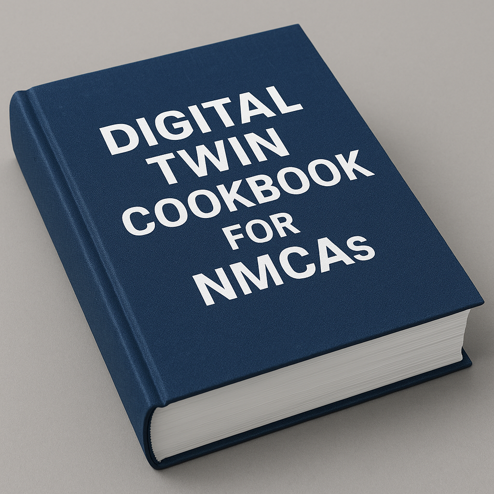

### Welcome to the Digital Twin cookbook for NMCAs. 

This repository is a collection of resources, research and discussion on how NMCAs can best engage with Digital Twins. 

If it is your first time here, it is advised that you start by reading the sections on [the need for a DT cookbook for NMCAs](why-we-need-a-DT-cookbook.md), [the intentions of this cookbook](cookbook-aims.md), [the "cookbook" concept](the-cookbook-concept.md), [how to use this repository](how-to-use-this-repository.md) and [who the repository is for](intended-audience.md). These sections will provide the necessary context to get the most out of the repository. 

The repository contains resources, research and discussion on the following topics: 

- [**What is a Digital Twin and why should we care about them?**](what-is-a-digital-twin/README.md):
    - *Introduction to [the digital twin concept](what-is-a-digital-twin/the-digital-twin-concept.md) and [components](what-is-a-digital-twin/digital-twin-components.md)*
    - *Discussion on [what a DT is, for NMCAs](what-is-a-digital-twin-for-NMCAs.md)*
    - *Introduction to [connected digital twins](what-is-a-digital-twin/connected-digital-twins.md).*

- [**Digital Twin Use Cases**](digital-twin-use-cases/README.md):
    - [*Summary of Digital Twin use cases*](digital-twin-use-cases/use-cases-overview.md)
    - *Case studies of note*
    - *Different use case complexities such as [basic](digital-twin-use-cases/basic-use-cases.md) or [complex](digital-twin-use-cases/complex-use-cases)*
    - [*Developing new use cases*.](digital-twin-use-cases/establishing-new-use-cases.md)

- [**Different Roles of NMCAs in Digital Twins**](role-nmca-in-digital-twins/README.md):
    - *[Different NMCA contributions to domain-specific digital twins](role-of-nmca-in-digital-twins/role-of-nmcas-in-domain-specific-digital-twins.md)*
    - *[NMCA contributions to scaling digital twins in a connected digital twin environment](role-of-nmca-in-digital-twins/role-of-nmcas-in-scaling-digital-twins.md)*.

- [**A business case template for NMCAs in Digital Twins**](nmca-digital-twin-business-case.md):
    - *Template for developing business cases for engaging with Digital Twins including the [value of digital twins to NMCAs](nmca-digital-twin-business-case/value-of-digital-twins-to-nmcas.md) and the [value of NMCAs to digital twins](nmca-digital-twin-business-case/value-of-nmcas-to-digital-twins.md)*
    - *[Market and stakeholder analysis](nmca-digital-twin-business-case/digital-twin-market-and-stakeholder-analysis.md)*
    - *[Strategies to obtain funding for digital twin projects.](nmca-digital-twin-business-case/nmca-funding-strategies.md)*

This project is currently being developed by Jack Metcalfe, a PhD student at University College London, UK and is being funded by EuroSDR. Please do not hesitate to get in touch with any questions, comments or feedback at jack.metcalfe.16@ucl.ac.uk. 

